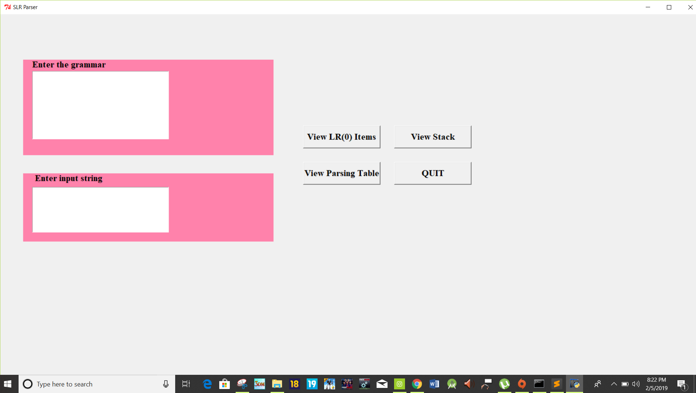

# SLR_Parser
A SLR_Parser which costructs canonical collection of LR(0) items and SLR Parsing table and also parses a given input string. 

The grammar can be edited in grammar2.txt file. Each symbol is separated by sapce and each rule in new line. 
The input string can be entered in the console or in th GUI. Make sure you add spaces between two symbols both in input string.
eg. id * id + id

## Console version only (simple)
For only the console version, run SLRParser.py in python 2. The input string can be entered in the console.

## GUI
Run main.py in python2. The grammar can be edited in grammar2.txt file. The input string can be added in the GUI. 

## Libraries required (for GUI version only)
Tkinter, graphviz, pydot

## Screenshots

 items")

  

